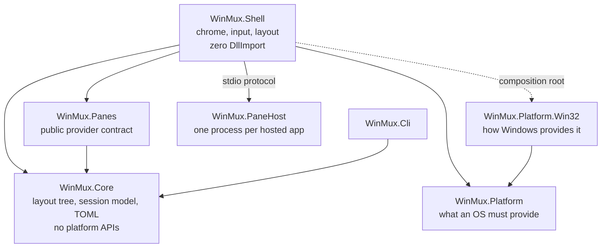

## The shape

Three rules hold this together, and each is enforced by a test rather than by discipline.

**`WinMux.Core` references no platform assembly.** Everything portable lives there. If the layout
engine ever needs a window handle, the design has gone wrong.

**`WinMux.Platform` is the shape of an operating system, never an implementation of one.** It states
intent — place this window here, tell me when focus moves — not steps, because the steps are what
differ between systems. `WinMux.Shell` declares **zero** `DllImport`, and exactly one file in it
names a concrete operating system.

**A hosted application lives in its own process.** `WinMux.PaneHost` owns the window; the shell never
calls a foreign application's handle. A frozen application freezes its own host and WinMux stays
alive — which was measured rather than assumed.

## Why it is shaped that way

The decisions are written down as they are made, with what failed as well as what worked. They are
the most useful thing in the repository if you are changing something and want to know whether the
obvious approach has already been tried.

Worth starting with:

- **[ADR 0001](/adr/0001-out-of-process-pane-hosts/)** — why a hosted application gets its own
  process, and the six-second freeze that proved it.
- **[ADR 0012](/adr/0012-phase-4-pane-providers-and-file-browser/)** — how panes became extensible,
  and why a pane kind is a string rather than an enum.
- **[ADR 0016](/adr/0016-windows-11-chrome/)** — the chrome, and a day mostly spent on a bug that
  was not in the application.
- **[ADR 0017](/adr/0017-input-queue-attachment/)** — a constraint the project carried for three
  phases, finally measured, and describing the wrong symptom the whole time.
