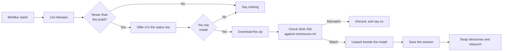

import { Aside, Steps } from '@astrojs/starlight/components';

WinMux checks GitHub for a newer release a few seconds after it starts, and tells you if it finds
one. **Nothing is downloaded or installed without being asked.**

## What happens



## Verification is not optional

Every release publishes `checksums.txt` alongside the archive. WinMux downloads it, finds the entry
for the file it is about to install, and **refuses to install anything whose SHA-256 does not
match** — or whose name is not in the manifest at all, or when the release published no manifest.

The download is over HTTPS, which says the bytes came from GitHub. The checksum says they are the
bytes the release build produced. Those are different claims and only the second one is the useful
one.

## Why it restarts

Windows keeps a running executable locked, so an application cannot overwrite itself in place.
WinMux unpacks the new version into a directory beside the installation, **saves your session**, and
hands a small script the job of swapping the directories once WinMux has exited and starting it
again. The old installation is kept until the new one has launched, so a failed swap has something
to go back to.

Your panes come back afterwards the same way they do after any restart — the programs in them are
started again, not resumed.

## Controlling it

**Settings → Updates**:

- **Check for updates on start** — on by default. Turning it off stops all network access.
- **Releases to offer** — *Stable only* by default. *Stable and prereleases* also offers tagged
  builds that have not been declared stable.

A prerelease never appears on the stable channel, whether it is marked prerelease on GitHub or
merely carries a suffix in its tag — either signal alone is routinely wrong, so both count.

<Aside type="tip" title="Doing it by hand">
**Help → Check for updates** asks now. **Help → Install update…** downloads and installs the one
that was found. **Help → Release notes** opens the releases page, which is also just
`https://github.com/rennerdo30/winmux/releases`.
</Aside>

## Offline

A failed check is a fact, not an error. WinMux says so only if you asked for the check by hand, and
carries on working exactly as before — nothing about the application depends on reaching GitHub.

## For maintainers

Releases are built by `.github/workflows/release.yml` on a `v*` tag. It builds, runs the tests,
packages with `scripts/publish.ps1`, writes `checksums.txt`, and publishes both. A tag containing a
dash is published as a prerelease automatically.

```powershell
git tag v0.7.0
git push origin v0.7.0
```
