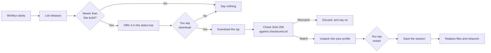

import { Aside, Steps } from '@astrojs/starlight/components';

WinMux checks GitHub for a newer release a few seconds after it starts, and tells you if it finds
one. **Nothing is downloaded or installed without being asked.**

Updates live where they do in every other application: **Help → About WinMux**. Opening it checks;
if there is a newer release it offers **Download and install**, shows the progress, and then
**Restart WinMux** to finish. You can close the window while it downloads — the download carries
on, and the status bar says when it is ready.

## What happens


```mermaid
graph LR
    A[WinMux starts] --> B[List releases]
    B --> C{Newer than<br/>this build?}
    C -->|No| D[Say nothing]
    C -->|Yes| E[Offer it in the status bar]
    E --> F{You say<br/>download}
    F -->|No| D
    F -->|Yes| G[Download the zip]
    G --> H[Check SHA-256<br/>against checksums.txt]
    H -->|Mismatch| I[Discard, and say so]
    H -->|Match| J[Unpack into your profile]
    J --> R{You say<br/>restart}
    R --> K[Save the session]
    K --> L[Replace files and relaunch]
```

## Verification is not optional

Every release publishes `checksums.txt` alongside the archive. WinMux downloads it, finds the entry
for the file it is about to install, and **refuses to install anything whose SHA-256 does not
match** — or whose name is not in the manifest at all, or when the release published no manifest.

The download is over HTTPS, which says the bytes came from GitHub. The checksum says they are the
bytes the release build produced. Those are different claims and only the second one is the useful
one.

## Why it restarts

Windows keeps a running executable locked, so an application cannot overwrite itself in place.
WinMux unpacks the new version into `%LOCALAPPDATA%\WinMux\update-staged`, **saves your session**,
and hands a small script the job once WinMux has closed. The script renames each old file aside —
Windows allows that even for a file still in use — and puts the new one in its place. If any file
cannot be replaced, everything is put back as it was. **Either way WinMux starts again**, on the
same session, and says in the status bar whether the update went in. Every step is written to
`%LOCALAPPDATA%\WinMux\update.log`.

If you have edited `foreign-app-quirks.json`, your copy is kept beside the new one as
`foreign-app-quirks.json.before-update`.

If WinMux was installed with the setup program, the version listed in **Installed apps** is updated
too. If it runs from a folder it cannot write to — a zip unpacked under Program Files — it says so
before downloading anything, rather than failing after a restart.

<Aside type="caution" title="Updating from 0.7.3 or earlier">
The updater in those versions could fail to install and not restart. Install 0.7.4 once by hand —
download the zip from the releases page and unpack it over your WinMux folder with WinMux closed.
Updates after that use the new installer.
</Aside>

Your panes come back afterwards the same way they do after any restart — the programs in them are
started again, not resumed.

## Controlling it

**Settings → Updates**:

- **Check for updates on start** — on by default. Turning it off stops all network access: About
  then says checks are off and offers a **Check for updates** button instead of checking by itself.
- **Releases to offer** — *Stable only* by default. *Stable and prereleases* also offers tagged
  builds that have not been declared stable.

A prerelease never appears on the stable channel, whether it is marked prerelease on GitHub or
merely carries a suffix in its tag — either signal alone is routinely wrong, so both count.

<Aside type="tip" title="From the keyboard or a script">
`check-for-updates` and `install-update` are in the command palette, and `wmux about` and
`wmux update` reach the same window from a terminal. **Help → Release notes** opens the releases
page, which is also just `https://github.com/rennerdo30/winmux/releases`.
</Aside>

## Offline

A failed check is a fact, not an error. WinMux says so only if you asked for the check by hand, and
carries on working exactly as before — nothing about the application depends on reaching GitHub.

## For maintainers

Releases are built by `.github/workflows/release.yml` on a `v*` tag. It builds, runs the tests,
packages with `scripts/publish.ps1`, builds the setup program with `scripts/build-installer.ps1`
(a pinned, signature-checked Inno Setup), installs and uninstalls it with
`scripts/test-installer.ps1`, writes `checksums.txt` for the zip and the setup program, and
publishes all three. A tag containing a dash is published as a prerelease automatically. The
reasoning is in [ADR 0030](/adr/0030-installer-and-about-window/).

```powershell
git tag v0.7.0
git push origin v0.7.0
```
